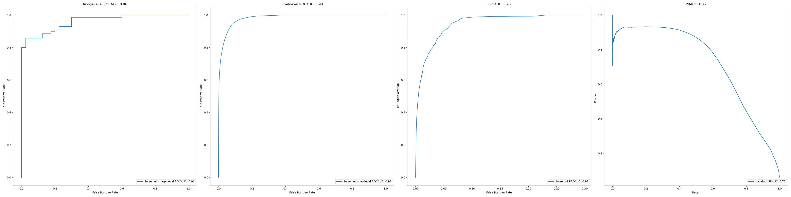
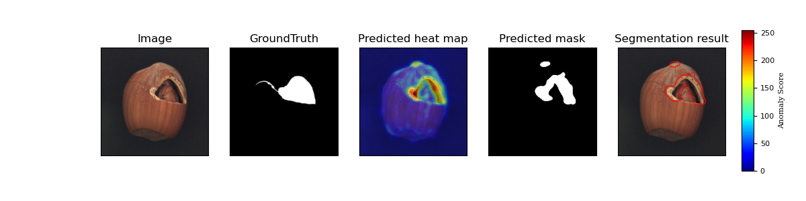
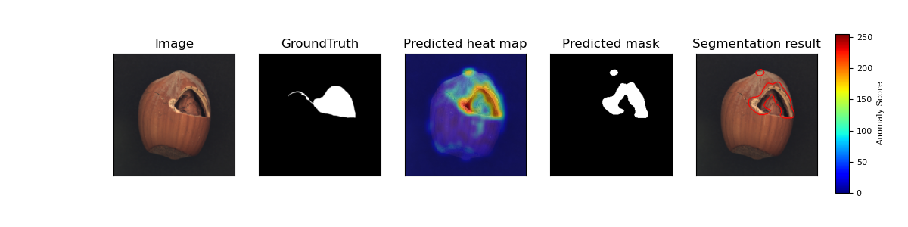

# anomaly-detection

## Results
* Image-level anomaly detection accuracy (ROCAUC)

|Category|Original_L2_128|Original_SSIM_128|Large_L2_2048|Large_SSIM_2048|
|:---:|:---:|:---:|:---:|:---:|
|Carpet| | | | |
|Grid| | | | |
|Leather| | | | |
|Tile| | | | |
|Wood| | | | |
|All texture classes| | | | |
|Bottle| | | | |
|Cable| | | | |
|Capsule| | | | |
|Hazelnut| | | | |
|Metal nut| | | | |
|Pill| | | | |
|Screw| | | | |
|Toothbrush| | | | |
|Transistor| | | | |
|Zipper| | | | |
|All object classes| | | | |
|All classes| | | | |

* Pixel-level anomaly detection accuracy (ROCAUC)

|Category|Original_L2_128|Original_SSIM_128|Large_L2_2048|Large_SSIM_2048|
|:---:|:---:|:---:|:---:|:---:|
|Carpet| | | | |
|Grid| | | | |
|Leather| | | | |
|Tile| | | | |
|Wood| | | | |
|All texture classes| | | | |
|Bottle| | | | |
|Cable| | | | |
|Capsule| | | | |
|Hazelnut| | | | |
|Metal nut| | | | |
|Pill| | | | |
|Screw| | | | |
|Toothbrush| | | | |
|Transistor| | | | |
|Zipper| | | | |
|All object classes| | | | |
|All classes| | | | |

* Per-region-overlap detection accuracy (PROAUC)

|Category|Original_L2_128|Original_SSIM_128|Large_L2_2048|Large_SSIM_2048|
|:---:|:---:|:---:|:---:|:---:|
|Carpet| | | | |
|Grid| | | | |
|Leather| | | | |
|Tile| | | | |
|Wood| | | | |
|All texture classes| | | | |
|Bottle| | | | |
|Cable| | | | |
|Capsule| | | | |
|Hazelnut| | | | |
|Metal nut| | | | |
|Pill| | | | |
|Screw| | | | |
|Toothbrush| | | | |
|Transistor| | | | |
|Zipper| | | | |
|All object classes| | | | |
|All classes| | | | |

* Precision-recall detection accuracy (PRAUC)

|Category|Original_L2_128|Original_SSIM_128|Large_L2_2048|Large_SSIM_2048|
|:---:|:---:|:---:|:---:|:---:|
|Carpet| | | | |
|Grid| | | | |
|Leather| | | | |
|Tile| | | | |
|Wood| | | | |
|All texture classes| | | | |
|Bottle| | | | |
|Cable| | | | |
|Capsule| | | | |
|Hazelnut| | | | |
|Metal nut| | | | |
|Pill| | | | |
|Screw| | | | |
|Toothbrush| | | | |
|Transistor| | | | |
|Zipper| | | | |
|All object classes| | | | |
|All classes| | | | |

### Metrics Curve

* Large_L2_2048 - SSIM

    

### Segmentation examples
* Large_L2_2048 - L1

    

* Large_L2_2048 - L2

    

* Large_L2_2048 - SSIM

    

* Large_L2_2048 - L1 + L2 + SSIM

    
